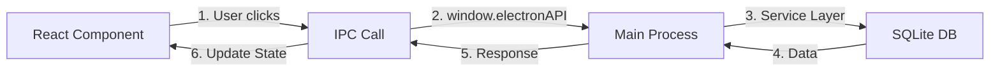

# Roadmap Electron - Detailed Implementation Plan

**Version:** 2.0  
**Last Updated:** December 7, 2025  
**Target Audience:** Junior Developers  
**Current Status:** 75% Complete  

---

## Table of Contents

1. [Project Overview](#1-project-overview)
2. [Development Environment Setup](#2-development-environment-setup)
3. [Architecture Understanding](#3-architecture-understanding)
4. [Completed Modules Reference](#4-completed-modules-reference)
5. [Modules to Complete](#5-modules-to-complete)
6. [Implementation Guidelines](#6-implementation-guidelines)
7. [Testing Requirements](#7-testing-requirements)
8. [Troubleshooting Guide](#8-troubleshooting-guide)

---

## 1. Project Overview

### What is Built
The Roadmap Electron application is a desktop project management tool that currently has:
- ✅ **75% Complete** - Most core features working
- ✅ **Production Ready** - Financial Coordinator module
- ⏸️ **25% Complete** - Governance module (parked)
- 🔴 **Not Started** - Reporting module

### Technology Stack You'll Work With
```
Frontend: React 19 + TypeScript + Vite
Backend: Electron + Node.js + SQLite
IPC: Electron's contextBridge for secure communication
State: Zustand stores + Local component state
Styling: Inline styles + CSS modules
```

### Critical Files to Understand First
1. **app/main/main.ts** - Electron entry point
2. **app/main/preload.ts** - IPC bridge definition
3. **app/main/db.ts** - Database schema
4. **app/renderer/App.tsx** - React entry point
5. **docs/QUICK-REFERENCE.md** - Critical bug fixes

---

## 2. Development Environment Setup

### Prerequisites Installation

#### Step 1: Install Required Software
```bash
# Install Node.js 18+ from https://nodejs.org
# Install Git from https://git-scm.com
# Install VS Code from https://code.visualstudio.com
```

#### Step 2: Clone and Setup Project
```bash
# Clone repository
git clone [repository-url]
cd Roadmap-Electron

# Install dependencies
npm install

# IMPORTANT: If better-sqlite3 fails
npm run rebuild:better-sqlite3
```

#### Step 3: Verify Setup
```bash
# Run in development mode
npm run dev

# You should see:
# - Vite server starting on port 5173
# - Electron window opening
# - Console logs showing database initialization
```

### VS Code Extensions to Install
- **ESLint** - Code quality
- **Prettier** - Code formatting
- **TypeScript and JavaScript** - Language support
- **SQLite Viewer** - Database inspection
- **React snippets** - Faster coding

### Understanding the File Structure
```
Roadmap-Electron/
├── app/
│   ├── main/           # Electron backend (Node.js)
│   │   ├── services/   # Business logic
│   │   ├── ipc/        # IPC handlers
│   │   └── db.ts       # Database
│   └── renderer/       # React frontend
│       ├── components/ # UI components
│       ├── pages/      # Full screens
│       └── stores/     # State management
├── dist/               # Build output (git ignored)
├── tests/              # Test files
└── docs/               # Documentation
```

---

## 3. Architecture Understanding

### Data Flow Pattern (MUST UNDERSTAND)



### IPC Communication Pattern

#### Frontend (Renderer) Side:
```typescript
// ALWAYS use this pattern for API calls
const projects = await window.electronAPI.request('project:getAll');

// NEVER use old patterns like:
// ❌ window.electronAPI.getProjects()
// ❌ window.api.projects.get()
```

#### Backend (Main) Side:
```typescript
// In app/main/ipc/projectHandlers.ts
ipcMain.handle('project:getAll', async () => {
  return await ProjectService.getAllProjects(db);
});
```

### Database Conventions

#### Critical Rules:
1. **Dates:** Always store in DD-MM-YYYY format (NZ standard)
2. **Money:** Store as cents (INTEGER), display as NZD
3. **Status:** Only use: `planned | in-progress | blocked | done | archived`

#### Example Database Operation:
```typescript
// Converting money for storage
const budgetCents = Math.round(parseFloat(budgetNzd) * 100);

// Converting for display
const budgetNzd = (budgetCents || 0) / 100;
```

---

## 4. Completed Modules Reference

### ✅ Core Project Management (100% Complete)

#### Key Files:
- **Services:** `app/main/services/ProjectService.ts`, `TaskService.ts`
- **Components:** `app/renderer/components/projects/*`
- **IPC:** `app/main/ipc/projectHandlers.ts`

#### How It Works:
1. Projects stored in `projects` table
2. Tasks linked via `project_id`
3. Multi-row timeline prevents overlaps
4. Drag/drop updates position in real-time

#### Example: Creating a Project
```typescript
// Frontend
const handleCreate = async (data) => {
  const result = await window.electronAPI.request('project:create', {
    title: data.title,
    start_date: data.startDate, // DD-MM-YYYY
    end_date: data.endDate,     // DD-MM-YYYY
    status: 'planned',
    budget_nzd: data.budget      // "1,234.56"
  });
  
  if (result.success) {
    refreshProjects();
  }
};

// Backend Service
createProject(data) {
  // Validate
  const validation = this.validateProject(data);
  if (!validation.isValid) {
    return { success: false, errors: validation.errors };
  }
  
  // Convert and save
  const budgetCents = NZCurrency.parseToCents(data.budget_nzd);
  // ... database insert
}
```

### ✅ Financial Coordinator (100% Complete)

#### Key Files:
- **Import Services:** `app/main/services/coordinator/*ImportService.ts`
- **Pages:** `app/renderer/pages/CoordinatorImport.tsx`, `ResourceManagementPage.tsx`
- **Finance:** `app/renderer/pages/ProjectFinance.tsx`

#### Import Workflow:
1. User selects CSV type (Timesheets/Actuals/Labour Rates)
2. System validates CSV format
3. Data imported to `raw_*` tables
4. Variance detection runs automatically
5. Alerts generated for issues

#### CSV Format Example (Timesheets):
```csv
Employee,WBS Element,Period,Hours,Activity Type
John Smith,WBS-001,2025-11,160,N3_CAP
Jane Doe,WBS-002,2025-11,120,N2_OPX
```

### ✅ Dependencies (100% Complete)

#### How Dependency Creation Works:
1. User clicks "+" on source timeline bar
2. Rubber-band line follows cursor
3. User clicks target bar
4. System validates (no cycles, self-links)
5. Dependency saved with type (FS default)

#### Validation Code:
```typescript
// Cycle detection using DFS
function hasCycle(dependencies, newDep) {
  const visited = new Set();
  const stack = new Set();
  
  function dfs(nodeId) {
    if (stack.has(nodeId)) return true; // Cycle!
    if (visited.has(nodeId)) return false;
    
    visited.add(nodeId);
    stack.add(nodeId);
    
    const children = dependencies
      .filter(d => d.from_id === nodeId)
      .map(d => d.to_id);
    
    for (const child of children) {
      if (dfs(child)) return true;
    }
    
    stack.delete(nodeId);
    return false;
  }
  
  return dfs(newDep.from_id);
}
```

---

## 5. Modules to Complete

### 🔴 Priority 1: ADO Integration (5% Remaining)

#### What's Done:
- ✅ Configuration UI
- ✅ PAT token encryption
- ✅ Basic sync to ADO
- ✅ Webhook infrastructure

#### What's Needed:
1. **Real-time Bi-directional Sync**
   - Location: Create `app/main/services/ado/AdoRealtimeSync.ts`
   - Requirements:
     ```typescript
     class AdoRealtimeSync {
       // Poll ADO every 30 seconds for changes
       startSync(interval = 30000) {
         setInterval(() => {
           this.checkForUpdates();
           this.pushLocalChanges();
         }, interval);
       }
       
       // Compare timestamps and sync
       async checkForUpdates() {
         const lastSync = await this.getLastSyncTime();
         const adoItems = await this.adoApi.getUpdatedSince(lastSync);
         // Update local database
       }
     }
     ```

2. **Conflict Resolution UI**
   - Location: Create `app/renderer/components/ado/ConflictResolver.tsx`
   - Show side-by-side comparison
   - Let user choose which version to keep
   - Log resolution decisions

3. **Bulk Operations**
   - Add batch update methods to `AdoApiService.ts`
   - Implement progress tracking
   - Add cancel capability

### 🔴 Priority 2: Governance Module (75% Remaining)

#### What's Done:
- ✅ Database schema (14 tables)
- ✅ TypeScript types
- ✅ Validation layer
- ✅ Default data (gates, policies)

#### Phase 3: Complete Repositories (1 week)

Create these repository files in `app/main/repositories/`:

1. **GateRepository.ts**
```typescript
export class GateRepository {
  constructor(private db: DB) {}
  
  getAll(): GovernanceGate[] {
    return this.db.prepare('SELECT * FROM governance_gates ORDER BY sequence').all();
  }
  
  getById(id: string): GovernanceGate | undefined {
    return this.db.prepare('SELECT * FROM governance_gates WHERE id = ?').get(id);
  }
  
  create(gate: Omit<GovernanceGate, 'id'>): GovernanceGate {
    const id = `GATE-${Date.now()}`;
    // Insert and return
  }
  
  update(id: string, updates: Partial<GovernanceGate>): boolean {
    // Update logic
  }
  
  delete(id: string): boolean {
    // Soft delete by setting is_active = false
  }
}
```

2. **ComplianceRepository.ts**
3. **DecisionRepository.ts**
4. **EscalationRepository.ts**
5. **BenefitsRepository.ts**

#### Phase 4: Build Core Services (1 week)

Create service files in `app/main/services/governance/`:

1. **StageGateService.ts**
```typescript
export class StageGateService {
  async moveProjectToGate(projectId: string, gateId: string) {
    // 1. Check if all criteria met
    const criteria = await this.checkGateCriteria(projectId, gateId);
    if (!criteria.allMet) {
      return { success: false, unmetCriteria: criteria.unmet };
    }
    
    // 2. Create gate review record
    const review = await this.createGateReview(projectId, gateId);
    
    // 3. Update project status
    await this.updateProjectGateStatus(projectId, gateId);
    
    // 4. Send notifications
    await this.notifyStakeholders(projectId, gateId);
    
    return { success: true, reviewId: review.id };
  }
}
```

2. **ComplianceService.ts**
3. **DecisionLogService.ts**
4. **EscalationService.ts**
5. **BenefitsTrackingService.ts**

#### Phase 5: IPC Handlers (3 days)

Create `app/main/ipc/governanceHandlers.ts`:

```typescript
export function registerGovernanceHandlers(ipcMain: IpcMain, db: DB) {
  const gateService = new StageGateService(db);
  const complianceService = new ComplianceService(db);
  
  // Gates
  ipcMain.handle('governance:gates:getAll', async () => {
    return await gateService.getAllGates();
  });
  
  ipcMain.handle('governance:gates:moveProject', async (_, { projectId, gateId }) => {
    return await gateService.moveProjectToGate(projectId, gateId);
  });
  
  // Compliance
  ipcMain.handle('governance:compliance:check', async (_, { projectId }) => {
    return await complianceService.checkCompliance(projectId);
  });
  
  // Add 50+ more handlers...
}
```

#### Phase 6: Frontend Components (2 weeks)

Create pages in `app/renderer/pages/governance/`:

1. **GovernanceDashboard.tsx** (Update existing)
```typescript
export const GovernanceDashboard: React.FC = () => {
  const [healthScore, setHealthScore] = useState<number>(0);
  const [projectsByGate, setProjectsByGate] = useState<ProjectsByGate>({});
  const [alerts, setAlerts] = useState<ComplianceAlert[]>([]);
  
  useEffect(() => {
    loadDashboardData();
  }, []);
  
  const loadDashboardData = async () => {
    const [health, gates, compliance] = await Promise.all([
      window.electronAPI.request('governance:health:calculate'),
      window.electronAPI.request('governance:gates:summary'),
      window.electronAPI.request('governance:compliance:alerts')
    ]);
    
    setHealthScore(health.score);
    setProjectsByGate(gates);
    setAlerts(compliance);
  };
  
  return (
    <div className="governance-dashboard">
      <HealthScoreCard score={healthScore} />
      <GateProgressChart data={projectsByGate} />
      <ComplianceAlertsList alerts={alerts} />
      {/* Add more widgets */}
    </div>
  );
};
```

2. **StageGateManager.tsx**
3. **ComplianceTracker.tsx**
4. **DecisionLog.tsx**
5. **EscalationManager.tsx**
6. **BenefitsRealization.tsx**

### 🔴 Priority 3: Reporting Module (100% Remaining)

#### Phase 1: Report Engine (1 week)

Create `app/main/services/reporting/ReportEngine.ts`:

```typescript
export class ReportEngine {
  constructor(private db: DB) {}
  
  async generateReport(type: ReportType, params: ReportParams): Promise<Report> {
    switch(type) {
      case 'executive-summary':
        return this.generateExecutiveSummary(params);
      case 'portfolio-health':
        return this.generatePortfolioHealth(params);
      case 'financial-variance':
        return this.generateFinancialVariance(params);
      // More report types
    }
  }
  
  private async generateExecutiveSummary(params): Promise<Report> {
    // Gather data
    const projects = await this.getProjectSummary(params.dateRange);
    const finances = await this.getFinancialSummary(params.dateRange);
    const risks = await this.getRiskSummary();
    
    // Format report
    return {
      title: 'Executive Summary',
      generatedAt: new Date(),
      sections: [
        { type: 'summary', data: this.formatSummary(projects) },
        { type: 'chart', data: this.formatFinanceChart(finances) },
        { type: 'table', data: this.formatRiskTable(risks) }
      ]
    };
  }
}
```

#### Phase 2: PDF Generation (1 week)

Install dependencies:
```bash
npm install puppeteer jspdf html2canvas
```

Create `app/main/services/reporting/PdfGenerator.ts`:

```typescript
import puppeteer from 'puppeteer';

export class PdfGenerator {
  async generatePdf(report: Report): Promise<Buffer> {
    const browser = await puppeteer.launch();
    const page = await browser.newPage();
    
    // Generate HTML from report
    const html = this.reportToHtml(report);
    await page.setContent(html);
    
    // Add styling
    await page.addStyleTag({ content: this.getReportStyles() });
    
    // Generate PDF
    const pdf = await page.pdf({
      format: 'A4',
      printBackground: true,
      margin: { top: '20mm', bottom: '20mm', left: '15mm', right: '15mm' }
    });
    
    await browser.close();
    return pdf;
  }
  
  private reportToHtml(report: Report): string {
    return `
      <!DOCTYPE html>
      <html>
        <head><title>${report.title}</title></head>
        <body>
          <header>
            <h1>${report.title}</h1>
            <p>Generated: ${report.generatedAt}</p>
          </header>
          ${report.sections.map(s => this.sectionToHtml(s)).join('')}
        </body>
      </html>
    `;
  }
}
```

#### Phase 3: Report UI (1 week)

Create `app/renderer/pages/ReportGenerator.tsx`:

```typescript
export const ReportGenerator: React.FC = () => {
  const [reportType, setReportType] = useState<string>('executive-summary');
  const [dateRange, setDateRange] = useState({ start: '', end: '' });
  const [generating, setGenerating] = useState(false);
  
  const generateReport = async () => {
    setGenerating(true);
    try {
      const report = await window.electronAPI.request('reporting:generate', {
        type: reportType,
        params: { dateRange }
      });
      
      // Download PDF
      const pdf = await window.electronAPI.request('reporting:export:pdf', {
        reportId: report.id
      });
      
      downloadFile(pdf, `${reportType}-${Date.now()}.pdf`);
    } finally {
      setGenerating(false);
    }
  };
  
  return (
    <div className="report-generator">
      <h2>Generate Report</h2>
      
      <SelectInput
        label="Report Type"
        value={reportType}
        onChange={setReportType}
        options={[
          { value: 'executive-summary', label: 'Executive Summary' },
          { value: 'portfolio-health', label: 'Portfolio Health' },
          { value: 'financial-variance', label: 'Financial Variance' }
        ]}
      />
      
      <DateRangePicker
        startDate={dateRange.start}
        endDate={dateRange.end}
        onChange={setDateRange}
      />
      
      <button onClick={generateReport} disabled={generating}>
        {generating ? 'Generating...' : 'Generate Report'}
      </button>
    </div>
  );
};
```

---

## 6. Implementation Guidelines

### Code Style Rules

#### TypeScript Best Practices
```typescript
// ✅ GOOD: Use type annotations
const processProject = (project: Project): ProcessedProject => {
  return { ...project, processed: true };
};

// ❌ BAD: Avoid 'any'
const processProject = (project: any) => {
  return { ...project, processed: true };
};

// ✅ GOOD: Use enums for constants
enum ProjectStatus {
  Planned = 'planned',
  InProgress = 'in-progress',
  Blocked = 'blocked',
  Done = 'done',
  Archived = 'archived'
}

// ❌ BAD: Magic strings
if (project.status === 'in-progress') { }
```

#### React Component Patterns
```typescript
// ✅ GOOD: Functional components with TypeScript
interface ProjectCardProps {
  project: Project;
  onEdit: (id: string) => void;
  onDelete: (id: string) => void;
}

export const ProjectCard: React.FC<ProjectCardProps> = ({ 
  project, 
  onEdit, 
  onDelete 
}) => {
  // Component logic
};

// ❌ BAD: Class components (unless necessary)
class ProjectCard extends React.Component { }
```

### Error Handling Pattern

#### Frontend Error Handling
```typescript
const handleSave = async () => {
  try {
    setLoading(true);
    setError(null);
    
    const result = await window.electronAPI.request('project:save', data);
    
    if (result.success) {
      showSuccess('Project saved successfully');
      onClose();
    } else {
      setError(result.error || 'Failed to save project');
    }
  } catch (err: any) {
    console.error('Save failed:', err);
    setError(err.message || 'An unexpected error occurred');
  } finally {
    setLoading(false);
  }
};
```

#### Backend Error Handling
```typescript
ipcMain.handle('project:save', async (_, data) => {
  try {
    // Validate input
    if (!data.title) {
      return { success: false, error: 'Title is required' };
    }
    
    // Process
    const project = await ProjectService.save(db, data);
    return { success: true, data: project };
    
  } catch (error: any) {
    // Log error
    console.error('Project save error:', error);
    
    // Return safe error message
    return { 
      success: false, 
      error: 'Failed to save project. Please try again.' 
    };
  }
});
```

### State Management Rules

#### When to Use What
1. **Local State (useState)** - Component-specific UI state
   ```typescript
   const [isOpen, setIsOpen] = useState(false);
   const [search, setSearch] = useState('');
   ```

2. **IPC Calls** - Data fetching and persistence
   ```typescript
   const projects = await window.electronAPI.request('project:getAll');
   ```

3. **Zustand Store** - Shared state across components
   ```typescript
   // Only for complex shared state like governance module
   const useGovernanceStore = create((set) => ({
     healthScore: 0,
     setHealthScore: (score) => set({ healthScore: score })
   }));
   ```

### Database Migration Pattern

When adding new tables:

```typescript
// In app/main/db.ts
function ensureSchema(db: DB) {
  const currentVersion = db.pragma('user_version').get().user_version;
  
  if (currentVersion < 8) {
    db.transaction(() => {
      // Add your new table
      db.exec(`
        CREATE TABLE IF NOT EXISTS my_new_table (
          id TEXT PRIMARY KEY,
          name TEXT NOT NULL,
          created_at TEXT NOT NULL
        );
        
        CREATE INDEX idx_my_new_table_name ON my_new_table(name);
      `);
      
      // Update version
      db.pragma('user_version = 8');
    })();
  }
}
```

---

## 7. Testing Requirements

### Unit Test Structure

Create test files next to components:

```typescript
// ProjectCard.test.tsx
import { render, screen, fireEvent } from '@testing-library/react';
import { ProjectCard } from './ProjectCard';

describe('ProjectCard', () => {
  const mockProject = {
    id: 'PROJ-001',
    title: 'Test Project',
    status: 'planned',
    start_date: '01-01-2025',
    end_date: '31-12-2025'
  };
  
  it('renders project title', () => {
    render(<ProjectCard project={mockProject} />);
    expect(screen.getByText('Test Project')).toBeInTheDocument();
  });
  
  it('calls onEdit when edit clicked', () => {
    const onEdit = jest.fn();
    render(<ProjectCard project={mockProject} onEdit={onEdit} />);
    
    fireEvent.click(screen.getByRole('button', { name: /edit/i }));
    expect(onEdit).toHaveBeenCalledWith('PROJ-001');
  });
});
```

### Integration Test Example

```typescript
// tests/integration/project-flow.test.ts
describe('Project Creation Flow', () => {
  let db: DB;
  
  beforeEach(() => {
    // Create test database
    db = new Database(':memory:');
    ensureSchema(db);
  });
  
  it('creates project with all fields', async () => {
    const service = new ProjectService(db);
    
    const result = await service.createProject({
      title: 'Integration Test',
      start_date: '01-01-2025',
      end_date: '31-12-2025',
      status: 'planned',
      budget_nzd: '10,000.00'
    });
    
    expect(result.success).toBe(true);
    expect(result.project?.budget_cents).toBe(1000000); // 10,000.00 * 100
  });
});
```

### E2E Test Example

```typescript
// tests/e2e/project-management.spec.ts
import { test, expect } from '@playwright/test';

test('create and edit project', async ({ page }) => {
  // Navigate to projects
  await page.goto('http://localhost:5173');
  await page.click('text=Projects');
  
  // Create new project
  await page.click('button:has-text("New Project")');
  await page.fill('input[name="title"]', 'E2E Test Project');
  await page.fill('input[name="startDate"]', '01-01-2025');
  await page.fill('input[name="endDate"]', '31-12-2025');
  await page.click('button:has-text("Save")');
  
  // Verify created
  await expect(page.locator('text=E2E Test Project')).toBeVisible();
  
  // Edit project
  await page.click('text=E2E Test Project');
  await page.click('button:has-text("Edit")');
  await page.fill('input[name="title"]', 'Updated E2E Project');
  await page.click('button:has-text("Save")');
  
  // Verify updated
  await expect(page.locator('text=Updated E2E Project')).toBeVisible();
});
```

---

## 8. Troubleshooting Guide

### Common Issues and Solutions

#### Issue 1: Projects Not Loading
```
Symptom: Empty project list, no errors
```

**Check:**
1. Open DevTools Console (Ctrl+Shift+I)
2. Look for IPC errors
3. Verify API call format:
   ```typescript
   // ✅ Correct
   await window.electronAPI.request('project:getAll')
   
   // ❌ Wrong (old API)
   await window.electronAPI.getAllProjects()
   ```

#### Issue 2: Budget Shows as $0.00
```
Symptom: All budgets display as zero
```

**Fix:**
```typescript
// Check the conversion in ProjectService
budget_nzd: (project.budget_cents || 0) / 100  // Note the || 0

// Check display formatting
${(project.budget_nzd || 0).toLocaleString('en-NZ', { 
  minimumFractionDigits: 2 
})}
```

#### Issue 3: Database Locked Error
```
Error: SQLITE_BUSY: database is locked
```

**Solutions:**
1. Close other database connections
2. Restart the application
3. Check for unclosed transactions:
   ```typescript
   // Always use try-finally
   const transaction = db.transaction(() => {
     // operations
   });
   
   try {
     transaction();
   } finally {
     // Automatic cleanup
   }
   ```

#### Issue 4: Date Validation Errors
```
Error: Date must be in DD-MM-YYYY format
```

**Fix:**
```typescript
// Correct format function
const formatDate = (date: Date): string => {
  const day = date.getDate().toString().padStart(2, '0');
  const month = (date.getMonth() + 1).toString().padStart(2, '0');
  const year = date.getFullYear();
  return `${day}-${month}-${year}`;
};

// Parse function
const parseDate = (dateStr: string): Date => {
  const [day, month, year] = dateStr.split('-');
  return new Date(parseInt(year), parseInt(month) - 1, parseInt(day));
};
```

#### Issue 5: IPC Not Responding
```
Symptom: Buttons don't work, no response
```

**Debug Steps:**
1. Check main process console for errors
2. Verify handler registration:
   ```typescript
   // In main.ts
   registerProjectHandlers(ipcMain, db);  // Must be called
   ```
3. Check preload script:
   ```typescript
   // Must expose the API
   contextBridge.exposeInMainWorld('electronAPI', {
     request: (channel, data) => ipcRenderer.invoke(channel, data)
   });
   ```

### Performance Optimization Tips

#### Database Queries
```typescript
// ❌ BAD: N+1 queries
projects.forEach(async (project) => {
  const tasks = await db.prepare('SELECT * FROM tasks WHERE project_id = ?').all(project.id);
});

// ✅ GOOD: Single query with JOIN
const projectsWithTasks = db.prepare(`
  SELECT p.*, t.* 
  FROM projects p
  LEFT JOIN tasks t ON p.id = t.project_id
  ORDER BY p.start_date_iso
`).all();
```

#### React Rendering
```typescript
// ❌ BAD: Inline function creates new reference
<ProjectCard onEdit={() => handleEdit(project.id)} />

// ✅ GOOD: Stable callback
const handleEdit = useCallback((id: string) => {
  // edit logic
}, []);

<ProjectCard onEdit={handleEdit} />
```

### Debug Commands

Add these to package.json for debugging:

```json
{
  "scripts": {
    "dev:debug": "cross-env NODE_ENV=development ELECTRON_ENABLE_LOGGING=1 electron .",
    "test:db": "node scripts/test-database.js",
    "clean:db": "rimraf %APPDATA%/RoadmapTool/roadmap.db"
  }
}
```

---

## Implementation Checklist

### Before Starting Development
- [ ] Read `docs/QUICK-REFERENCE.md` for critical patterns
- [ ] Set up development environment
- [ ] Run application in dev mode successfully
- [ ] Understand the IPC pattern
- [ ] Review completed module examples

### For Each New Feature
- [ ] Create TypeScript types first
- [ ] Build backend service
- [ ] Add IPC handlers
- [ ] Create React components
- [ ] Add validation
- [ ] Write tests
- [ ] Update documentation

### Before Committing
- [ ] Run `npm run lint`
- [ ] Run `npm test`
- [ ] Run `npm run build:main && npm run build:renderer`
- [ ] Test the feature manually
- [ ] Update MODULE-IMPLEMENTATION-STATUS.md

### Common Gotchas to Avoid
1. **Never** use different status values than the 5 defined ones
2. **Always** use DD-MM-YYYY date format
3. **Always** store money as cents (integers)
4. **Always** check for null/undefined before calling methods
5. **Never** use the old API patterns (check QUICK-REFERENCE.md)

---

## Resources and Help

### Internal Documentation
- **ARCHITECTURE.md** - System design details
- **QUICK-REFERENCE.md** - Critical bug fixes
- **MODULE-IMPLEMENTATION-STATUS.md** - What's built
- **FINANCIAL-COORDINATOR-COMPLETE.md** - Financial module reference

### External Resources
- [Electron Documentation](https://www.electronjs.org/docs)
- [React Documentation](https://react.dev)
- [TypeScript Handbook](https://www.typescriptlang.org/docs)
- [SQLite Documentation](https://www.sqlite.org/docs.html)

### Getting Help
1. Check error messages in DevTools Console
2. Review similar completed modules for patterns
3. Search codebase for similar implementations
4. Check test files for usage examples

---

**Document Status:** Complete  
**For:** Junior Developers  
**Questions:** Document in project issues  
**Last Updated:** December 7, 2025